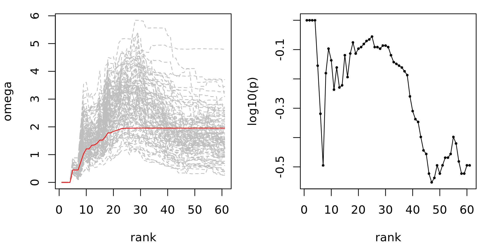
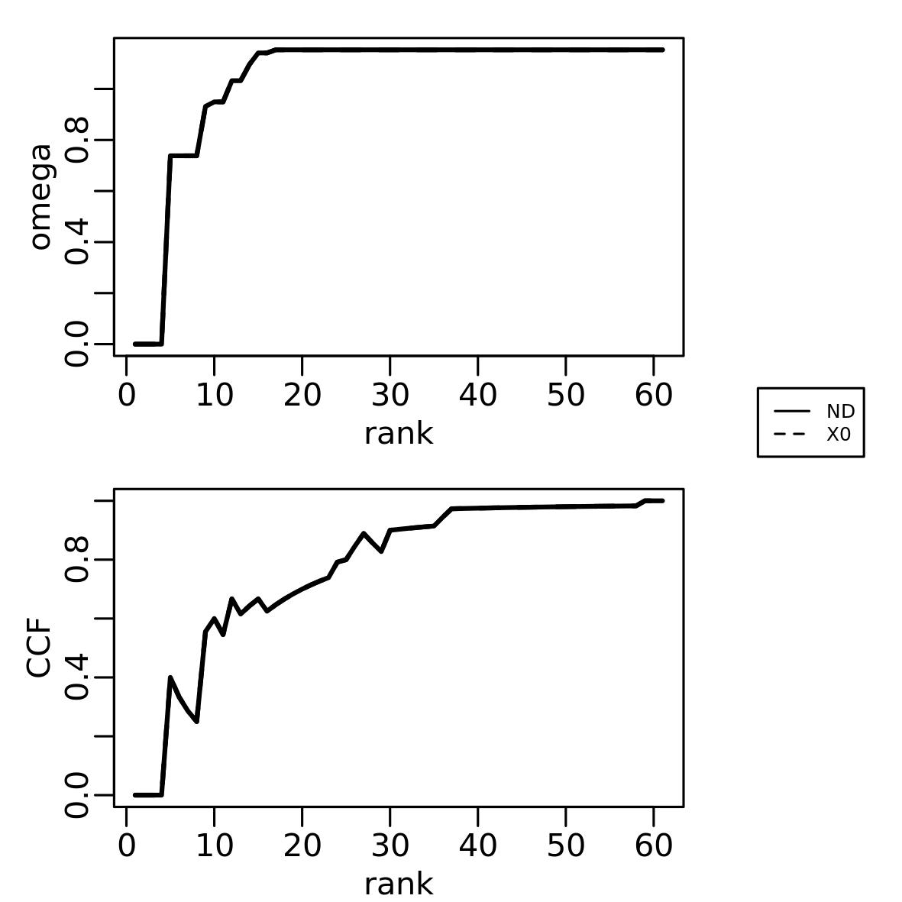
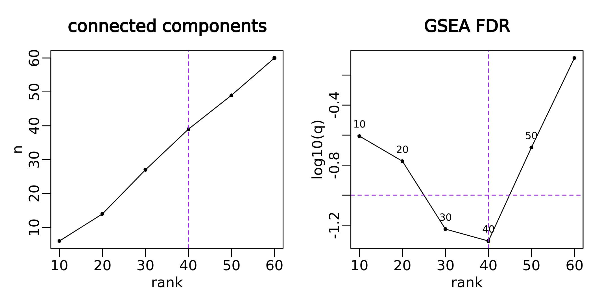
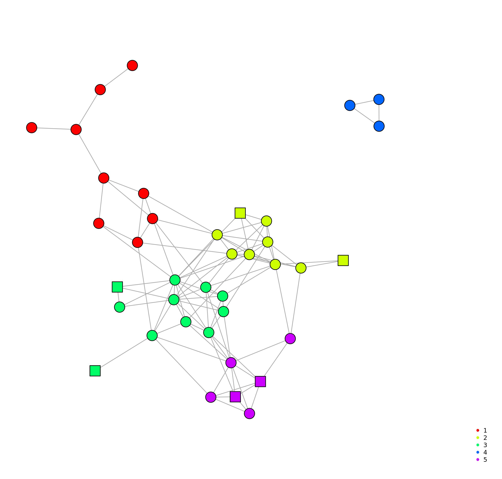
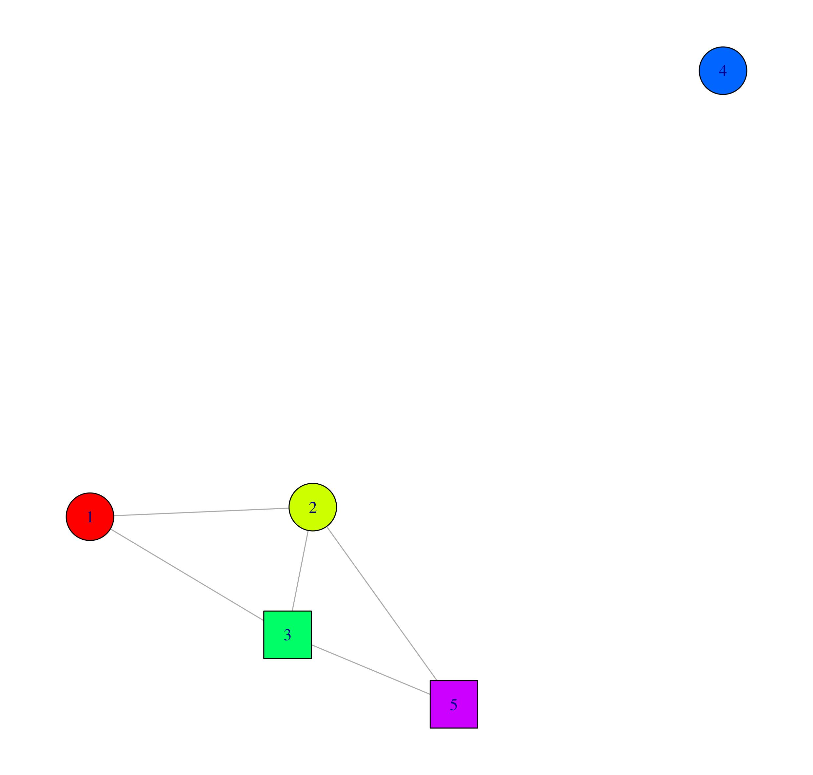
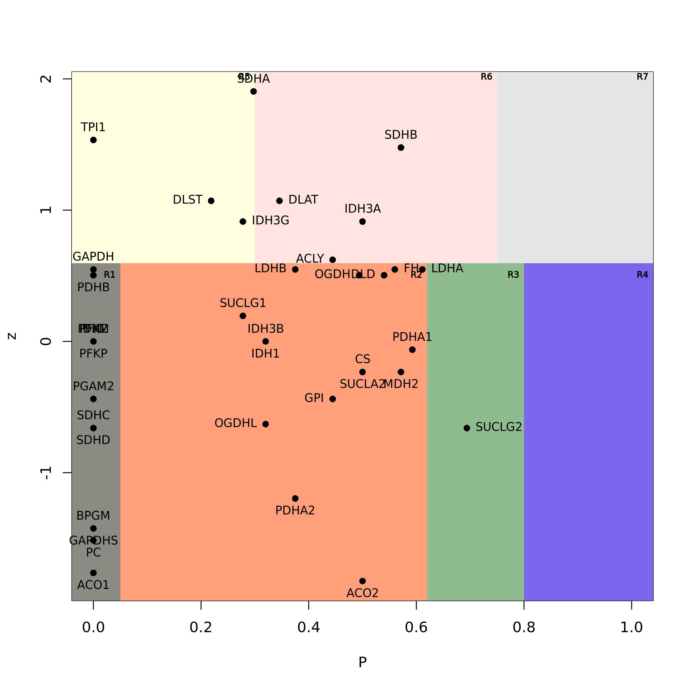

```{r setup, include=FALSE}
knitr::opts_chunk$set(
  comment  = "#>",
  error    = FALSE,
  warning  = FALSE,
  message  = FALSE,
  fig.width = 10
)
options(width = 100)
stopifnot(requireNamespace("htmltools"))
htmltools::tagList(rmarkdown::html_dependency_font_awesome())
```

---
```{r style, echo = FALSE, results = 'asis'}
  BiocStyle::markdown()
  devtools::load_all()
  data("dmfind_demo")
```

{width=300px}

# Introduction {#introduction}

This vignette describes how to use the package `r BiocStyle::Biocpkg("dmfind")`, which implements network diffusion-based analysis of omics data for the identification of differentially enriched modules.

If you use this package please cite:

- Bersanelli\*, Mosca\*, et al., Network diffusion-based analysis of high-throughput data for the detection of differentially enriched modules. Sci Rep 6, 34841 (2016). <https://doi.org/10.1038/srep34841> 


# Getting started {#gettingstarted}

## Installation 

To install this package, start R and enter:

```{r install, eval=FALSE}
if (!requireNamespace("BiocManager", quietly = TRUE)){
  install.packages("BiocManager")
}
BiocManager::install("dmfind")
```

## Overview of the workflow

The typical steps are the followings:

1. Definition of the input matrices;
2. Calculation of the network-smoothing index;
4. Definition of the top networks;
5. Topological analysis.

# Definition of the input matrices;

## Required input

The analysis requires the following inputs:

- $\mathbf{W}$, an $N \times N$ *normalized adjacency matrix*, which represents the interactions between genes; 
```{r W, echo=FALSE}
head(dmfind_demo$W[1:5, 1:5])
```

- $\mathbf{X}_0$, a $N \times m$ matrix with $m$ column vectors $\mathbf{x_0}$  of gene-related quantities; in the example below it is a 10 columns matrix with binary inputs

```{r X0, echo=FALSE}
dmfind_demo$X0ds[1:5, ]
```

- a vector to assign each column of $\mathbf{X}_0$ to any of two classes (only for differential NSI).

**IMPORTANT**:

* the two matrices must be defined over the same identifiers;
* the normalization of the adjacency matrix must be done by means of the function `normalize_adj_mat()`, which requires a symmetric binary adjacency matrix;
* the definition of $\mathbf{X}_0$ follows two scenarios:
  1. each column carries sample-level information (e.g., mutation profiles of patients) to be analysed by means of the differential NSI between two classes;
  2. each column incorporates any type of gene weights (e.g., $-log10(p)$) that will be analysed by means of the permutation-based NSI.
* in any case, the relevance of the rows of $\mathbf{X}_0$ is proportional to its values, that is, the higher the better; negative values are not allowed.

# Calculation of the network-smoothing index;

## Parameter selection

The networks smoothing index (NSI) compares the initial state $x_0$ with the steady-state $x_s$ reached after network diffusion:

$$ \mathbf{S} = \frac{\mathbf{x_s}}{\mathbf{x_0}+\epsilon} $$
where the parameter $\epsilon$ tunes the relevance of the initial state. The impact of $\epsilon$ can be assessed by means of the function `eval_eps()`, which scores the network proximity of $\mathbf{x_0}$ values in the networks composed by the top $k$ genes ranked by $S$. If $\mathbf{X}_0$ contains sample-level data we recommend to tune $\epsilon$ on the basis of the mean initial state of each class. So, the steps are:

1. Perform network diffusion to obtain the steady state; if $\mathbf{X}_0$ contains gene-weights to be analysed with permutation-adusted NSI:

```{r ND, eval=FALSE}
Xs <- ND(X0, W)$Xs
```

while, if $\mathbf{X}_0$ contains sample-level data:

```{r ND2, eval=FALSE}
X0_means <- calc_X0_mean(X0, classes)
Xs <- ND(X0_means, W)$Xs
```

2. run `eval_eps()` over some $\epsilon$ values:

```{r eval eps, eval=FALSE}
eps <- matrix(c(0.01, 0.1, 1, 10, 100), ncol=1)
G <- graph.adjacency(adjmatrix = sign(W), mode = "undirected")
out <- eval_eps(X0 = X0, Xs = Xs, eps = eps, G = g)
plot_omega_eps(out, column = 1)
```

where $g$ is the igraph object related to $\mathbf{W}$. The `column` argument of `plot_omega_eps` indicates the column of $\mathbf{X}_0$ against which to plot results. In the example below, we observe similar values of area under the curve (AUC) for $\epsilon>0.1$ calculated using $\mathbf{X}_0$ (left panel), with the highest AUC with $\epsilon=1$, which would be the choice in this case. In general, in cases where we have similar AUCs calculated using $\mathbf{X}_0$, it is possible to look at the AUCs calculated over $\mathbf{X}_s$ to guide the choice of $\epsilon=1$.


## Calculation of NSI

The differential NSI

$$\Delta \mathbf{S} = \mathbf{S}_2 - \mathbf{S}_1$$
can be calculated by means of the function `calc_dS()`:

```{r include=TRUE, eval=FALSE, message=FALSE, results='hide'}
resdS <- calc_dS(X0 = X0, W = W, classes = classes, eps = matrix(c(1, 1), ncol=2))
```
```{r echo=FALSE}
head(dmfind_demo$dS)
```
where `classes` is a $\{1,2\}-$vector that defines the class of $\mathbf{X}_0$ columns.

The permutation-based NSI

$$S_{p}(j)=-\text{log}_{10}(p(j)) \cdot S(j)$$

can be calculated by means of the function `calc_adjND()`:

```{r include=TRUE, eval=FALSE, message=FALSE, results='hide'}
resSp <- calc_adjND(X0 = X0, W = W, eps = matrix(1), k = 99, BPPARAM = MulticoreParam(2))
```
where `BPPARAM` is the optional `BiocParallelParam` instance that describes the parallel back-end and is passed to `bplapply()`, and `k` is the number of permutations. The resulting list contains...

```{r echo=FALSE}
head(dmfind_demo$Sp$S)
head(dmfind_demo$Sp$p)
head(dmfind_demo$Sp$Sp)
```

# Definition of the top networks;

## Network resampling
Network resampling can be used to asses the presence of significantly connected modules. 
```{r include=TRUE, eval=FALSE, message=FALSE, warning=FALSE, results='hide'}
nr_res <- NR(g, sort(resS$Sp[, 1], decreasing = T), k = 99,
          mc.cores = 2)
sigcomp <- find_sign_conn_comp(NR_summary = nr_res$NR_summary, NR_p_thr = 0.2)
plot_NR(nr_res, sign_comp_table = sigcomp$sign_comp_table)
```
```{r fig.width=4, eval=FALSE, echo=FALSE, warning=FALSE, message=F, results='show', eval=TRUE} 

```
The variation of the empirical $p$-value with gene rank suggests modules with high scores in network proximity. Note that this procedure is designed to focus on the top of a gene list, in this small example the top 30 genes out of a network of 61.

## Enrichment analysis
Sorting the genes by the initial score $X0$ we can see the enrichment level in the first $N$-ordered genes.
```{r include=TRUE, eval=FALSE, message=FALSE, warning=FALSE, results='hide'}
scores <- scores[order(-scores$X0), ]
compare_X0_ND(g, X0_ranked_by_ND = setNames(scores$X0, rownames(scores)),
              X0_ranked_by_X0 = sort(setNames(scores$X0, rownames(scores)), 
              decreasing = T), do.plot = T, file = "cmp_X0_ND.jpg", norm = "n")

ae_res <- assess_enrichment(G=g, top_list = rownames(scores), 
          ranked_vector_X0 = sort(setNames(scores$X0, rownames(scores)), 
          decreasing = T), do.plot = T, critical = sigcomp$critical,
          file="top_net_enrichment.jpg")
```
```{r, out.width="50%", eval=FALSE, echo=FALSE, warning=FALSE, message=F, results='show', eval=TRUE} 

```
```{r, out.width="50%", eval=FALSE, echo=FALSE, warning=FALSE, message=F, results='show', eval=TRUE} 

```

## Percentage of significant nodes

## Top networks definition
Based on the enrichment score, we define a subnetwork (top network) composed by the first $N$-ordered enriched genes.
```{r include=TRUE, eval=FALSE, message=FALSE, warning=FALSE, results='hide'}
top_network <- extract_module(graph = g, selected_vertices =
               nr_res$NR_summary$id, X0 = X0, 
               min_subnet_size = 2)
```

# Topological analysis

We can also assess a topological analysis of our network.
```{r include=TRUE, eval=FALSE, message=FALSE, warning=FALSE}
res_comm <- find_communities(top_network)
```

```{r fig.width=4, eval=FALSE, echo=FALSE, warning=FALSE, message=F, results='show', eval=TRUE} 

```

## Visualization - network of communities
```{r eval=FALSE, include=TRUE}
commNet <- comm_net(top_network)
plot_network(commNet[[1]], color_by = "comm_id", pal=pal, comm_w_in = 0.1, comm_w_b = 10,
             plot_outfile = "comm_net.jpg", legend.off = T, min_subnet_size = 2)
```
```{r, out.width="50%", eval=FALSE, echo=FALSE, warning=FALSE, message=F, results='show', eval=TRUE} 

```


## Define nodes roles based on partecipation coefficient and z-score
Each gene can be spatial represented. To define the role of each node we need to calculate the participation coefficient (pc) and the within module z-score (wmz). Then, based on those two parameters, we can define regions (and roles).

With this definition the space is divided in two categories: hubs and non-hubs.
To define who is a hub we cut the space on the y-axis, proportionally to the maximum value of z-score.
Then, we define regions accordingly to participation coefficient.

*For “non-hub” nodes:*

R1 – ultra peripheral nodes: nodes with all their links within their module (pc <= 0.05);

R2 – peripheral nodes: nodes with most links within their module (0.05 < pc <= 0.62);

R3 – non-hubs connector nodes: nodes with many links to other modules (0.62 < pc <= 0.8);

R4 – non-hubs kinless nodes: nodes with links homogeneously distributed among all modules (pc > 0.8).

*For the “hub” nodes:*

R5 – provincial nodes: hub nodes with the vast majority of links within their module (pc <= 0.3);

R6 – connector hubs: hubs with many links to most of the other modules (0.30 < pc <= 0.75);

R7 – kinless hubs: hubs with links homogeneously distributed among all modules (pc > 0.75).

```{r eval=FALSE, include=TRUE}
pc_wmz(top_network, do_plot=T, all_names = T)
```
```{r fig.width=4, eval=FALSE, echo=FALSE, warning=FALSE, message=F, results='show', eval=TRUE} 

```

## Network comparison
There are several ways to compare networks: with the function "net_comparison" we could perform some analysis, such as union, intersection, Jaccard index & Overlap coefficient calculation

The input data must be a list of n interactomes

To use this function you could create two or more toy model with the igraph function "barabasi.game", remember to set labels to the vertices.
```{r eval=FALSE, include=TRUE}
NetComp(NetList, union=T, intersection=T, centrMeas=T, ji=T, oc=T)
```

This function return a list containing the occurrences matrix where every column are the input networks
Optionally you can choose to perform the union, the intersection (both vertices and edges), the calculation of the Jaccard index, the Overlap coefficient and the centrality measures for every input interactome.

# Session Info {- .smaller}
```{r sessioninfo}
sessionInfo()

```
