```{r setup, include=FALSE}
knitr::opts_chunk$set(
  comment  = "#>",
  error    = FALSE,
  warning  = FALSE,
  message  = FALSE,
  fig.width = 10
)
options(width = 100)
stopifnot(requireNamespace("htmltools"))
htmltools::tagList(rmarkdown::html_dependency_font_awesome())
```

---
```{r style, echo = FALSE, results = 'asis'}
  BiocStyle::markdown()
  devtools::load_all()
  data("dmfind_demo")
```

{width=300px}

# Introduction {#introduction}

This vignette describes how to use the package `r BiocStyle::Biocpkg("dmfind")`, which implements network diffusion-based analysis of omics data for the identification of differentially enriched modules.

If you use this package please cite:

- Bersanelli\*, Mosca\*, et al., Network diffusion-based analysis of high-throughput data for the detection of differentially enriched modules. Sci Rep 6, 34841 (2016). <https://doi.org/10.1038/srep34841> 


# Getting started {#gettingstarted}

## Installation 

To install this package, start R and enter:

```{r install, eval=FALSE}
if (!requireNamespace("BiocManager", quietly = TRUE)){
  install.packages("BiocManager")
}
BiocManager::install("dmfind")
```

## Overview of the workflow

The typical steps are the followings:

1. Definition of the input matrices;
2. Calculation of the network-smoothing index;
4. Definition of the top networks;
5. Topological analysis.

# Definition of the input matrices;

The analysis requires the following inputs:

- $\mathbf{W}$, an $N \times N$ *normalized adjacency matrix*, which represents the interactions between genes, e.g.: 
```{r W, echo=FALSE}
head(dmfind_demo$W[1:5, 1:5])
```

- $\mathbf{X}_0$, a $N \times m$ matrix with column vectors $\mathbf{x_0}$ that contain gene-related quantities; in the example below it is a 10 columns matrix with binary inputs

```{r X0, echo=FALSE}
dmfind_demo$X0ds[1:5, ]
```

- a vector to assign each column of $\mathbf{X}_0$ to any of two classes (only for differential NSI, see below).

**IMPORTANT**:

* the two matrices must be defined over the same identifiers;
* the normalization of the adjacency matrix must be done by means of the function `normalize_adj_mat()`, which requires a symmetric binary adjacency matrix;
* the definition of $\mathbf{X}_0$ follows two scenarios:
  1. each column carries sample-level information (e.g., mutation profiles of patients) to be analysed by means of the differential NSI between two classes;
  2. each column incorporates any type of gene weights (e.g., $-\text{log}_{10}$ of $p$ values from statistical tests) that will be analysed by means of the permutation-based NSI.
* in any case, the relevance of the genes corresponding to the rows of $\mathbf{X}_0$ is proportional to its values, that is, the higher the better; negative values are not allowed.

# Calculation of the network-smoothing index;

## Parameter selection

The networks smoothing index (NSI) compares the initial state $\mathbf{x}_0$ with the steady-state $\mathbf{x}_s$ reached after network diffusion:

$$S(j) = \frac{x_s(j)}{x_0(j)+\epsilon}$$
where the parameter $\epsilon$ tunes the relevance of the initial state. The impact of $\epsilon$ can be assessed by means of the function `eval_eps()`, which scores the network proximity of $\mathbf{x_0}$ values in the networks composed by the top $k$ genes ranked by $S$. The scoring uses the $\Omega$ function [@Bersanelli2016]. Given the set $R_r$ defined by the top $r$ genes ranked by decreasing $S(\epsilon)$, we calculate:

$$\Omega_0 (R_r;\epsilon)=\mathbf{x}_0^T (R_r;\epsilon) \cdot \mathbf{A}(R_r;\epsilon) \cdot \mathbf{x}_0(R_r;\epsilon)$$
The values of $\Omega_0$ are calculated between the top $r \in \{2,\dots, n\}$ ranking genes by decreasing $S(\epsilon)$. The impact of different $\epsilon$ is quantified summing such $\Omega_0$ values. 

### Perform network diffusion to obtain the steady state.

if $\mathbf{X}_0$ contains gene-weights to be analysed with permutation-adusted NSI:

```{r ND, eval=FALSE}
Xs <- ND(X0, W)$Xs
```

while, if $\mathbf{X}_0$ contains sample-level data we recommend to tune $\epsilon$ on the basis of the mean initial state of each class:

```{r ND2, eval=FALSE}
X0_means <- calc_X0_mean(X0, classes)
Xs <- ND(X0_means, W)$Xs
```

### Run `eval_eps()` over some $\epsilon$ values:

```{r eval eps, eval=FALSE}
eps <- matrix(c(0.01, 0.1, 1, 10, 100), ncol=1)
G <- graph.adjacency(adjmatrix = sign(W), mode = "undirected")
out <- eval_eps(X0 = X0, Xs = Xs, eps = eps, G = g)
plot_omega_eps(out, column = 1)
```

where $g$ is the igraph object related to $\mathbf{W}$. The `column` argument of `plot_omega_eps` indicates the column of $\mathbf{X}_0$ against which to plot results.

In the example below, we observe similar values of area under the curve (AUC) for $\epsilon>0.1$ calculated using $\mathbf{X}_0$ (left panel), with the highest AUC with $\epsilon=1$, which would be the choice in this case. In general, in cases where we have similar AUCs calculated using $\mathbf{X}_0$, it is possible to look at the AUCs calculated over $\mathbf{X}_s$ to guide the choice of $\epsilon=1$.

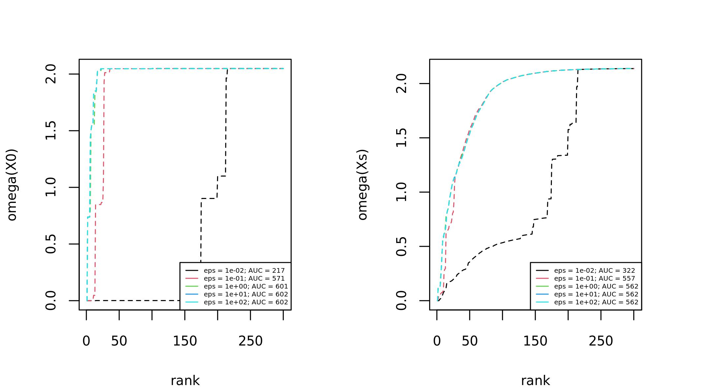


## Calculation of NSI

### Differential NSI (cases vs controls)

The differential NSI

$$\Delta \mathbf{S} = \mathbf{S}_2 - \mathbf{S}_1$$
can be calculated by means of the function `calc_dS()`:

```{r include=TRUE, eval=FALSE, message=FALSE, results='hide'}
resdS <- calc_dS(X0 = X0, W = W, classes = classes, eps = matrix(c(1, 1), ncol=2))
```
```{r echo=FALSE}
lapply(dmfind_demo$dS, head)
```
where `classes` is a $\{1,2\}-$vector that defines the class of $\mathbf{X}_0$ columns.

### Permutation-based NSI (vectors of gene weights)

The permutation-based NSI

$$S_{p}(j)=-\text{log}_{10}(p(j)) \cdot S(j)$$

can be calculated by means of the function `calc_adjND()`:

```{r include=TRUE, eval=FALSE, message=FALSE, results='hide'}
resSp <- calc_adjND(X0 = X0, W = W, eps = matrix(1), k = 99, BPPARAM = MulticoreParam(2))
```
where `BPPARAM` is the optional `BiocParallelParam` instance that describes the parallel back-end and is passed to `bplapply()`, and `k` is the number of permutations. The resulting list contains...

```{r echo=FALSE}
lapply(dmfind_demo$Sp, head)
```

## Visualization of the NSI values

After having calcualted the NSI, we recommend to explore the results by means of scatter plots. In case of $S_p$, typical plots include the relation between $S$ and its significance

```{r eval=FALSE}
plot_NSI(resSp, x="S", y="p")
```

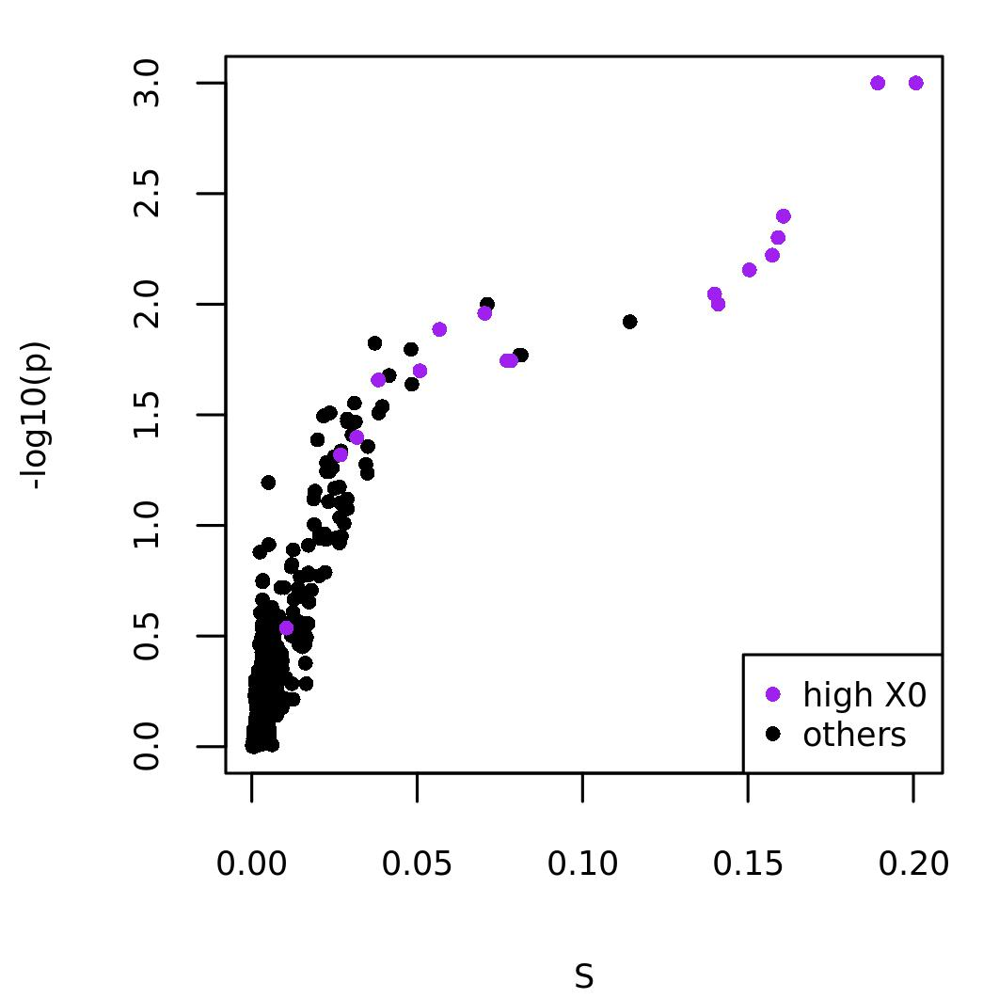{width=90%} 
and the relation between $S_p$ and the initial state:

```{r eval=FALSE}
plot_NSI(resSp, x = "X0", y="Sp")
```
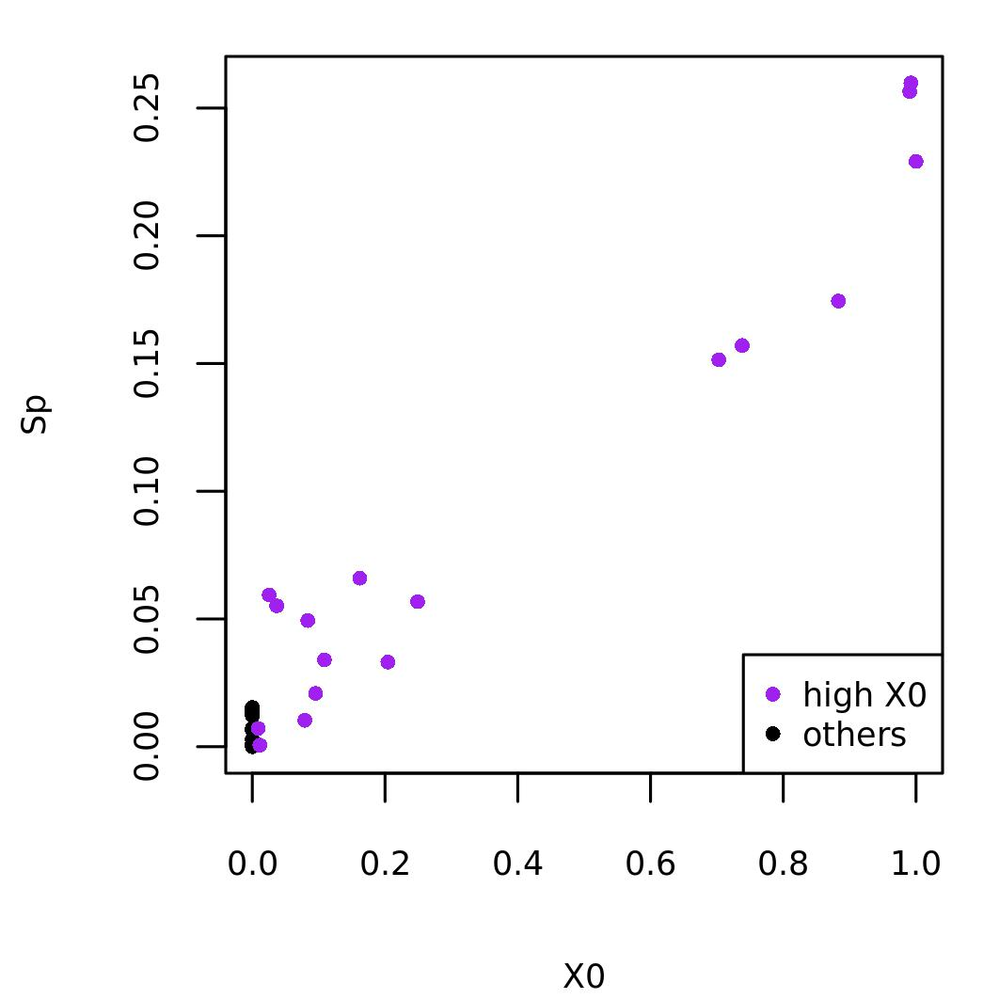{width=90%}

In case of $\Delta S$, the main visualization is that of $\Delta S$ vs the column of $\mathbf{X}_0$ relative to the cases (the second)

```{r eval=FALSE}
plot_NSI(resdS, x = "X0", y="dS", column = 2)
```
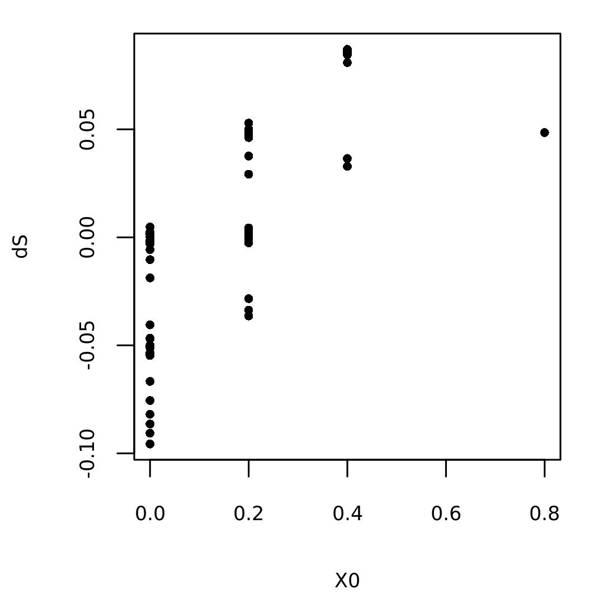{width=90%} 

# Definition of the top networks

The package `dmfind` provides two types of analysis to guide the choice of the "top" networks, that is the networks that contain the interactions between genes with high $\mathbf{X}_0$:

- **network resampling**, which scores the presence of genes with high NSI values in network proximity;
- **network enrichment**, which scores network enrichment in genes with high $\mathbf{X}_0$;
- **modularity analysis**, which scores network modularity

These analysis are applied over a number of top genes by $S_p$ or $\Delta S$. In human genome-wide analysis, a typical number could be 500.

## Network resampling

Network resampling can be used to asses the presence of significantly connected modules
```{r include=TRUE, eval=FALSE, message=FALSE, warning=FALSE, results='hide'}
nr_res <- NR(g, sort(resSp$Sp[, 1], decreasing = T), k = 99, mc.cores = 2)
plot_NR(nr_res)
```
In the example below, we observe that the real $\Omega$ vlaues begins to be clearly higher than permuted values after approximately the top 120 genes. This patterns indicate the presence of high scoring connected networks when considering the top 120 genes. Adding further genes neither improve nor worsens the situation.

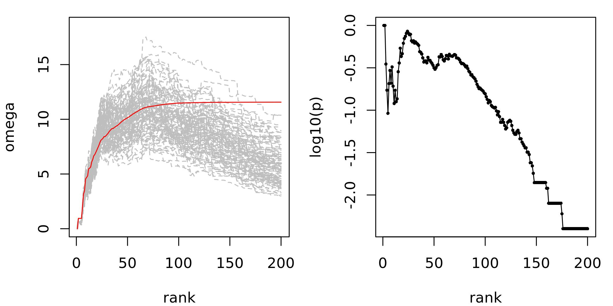{width=90%} 

## Enrichment analysis

The enrichment analysis assess to which extent the top networks are enriched in high $\mathbf{x}_0$ values. Depending on how $\mathbf{x}_0$ is defined, this task can be done by means of Over Representation Analysis (ORA) or Gene Set Enrichment Analysis (GSEA). In the following example, we explore the enrichment of the networks formed by the top 200 genes by $S_p$, using GSEA:

```{r include=TRUE, eval=FALSE, message=FALSE, warning=FALSE, results='hide'}
ae_res_gsea <- assess_enrichment(G=G, topList = rownames(resSp$Sp)[order(-resSp$Sp[, 1])[1:200]], X0Vector = sort(X0[, 1], decreasing = T), type = "gsea", k = 499) 
plot_net_enrich(ae_res_gsea)
```

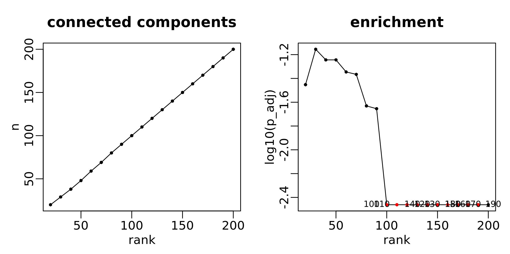{width=90%}

```{r echo=FALSE, message=FALSE, warning=FALSE, results='hide'}
head(dmfind_demo$ae_gsea$en_summary)
```
and using ORA:

```{r include=TRUE, eval=FALSE, message=FALSE, warning=FALSE, results='hide'}
ae_res_ora <- assess_enrichment(G=G, topList = rownames(resSp$Sp)[order(-resSp$Sp[, 1])[1:200]], X0Vector = sort(X0[, 1], decreasing = T), type = "ora")
plot_net_enrich(ae_res_ora)
```

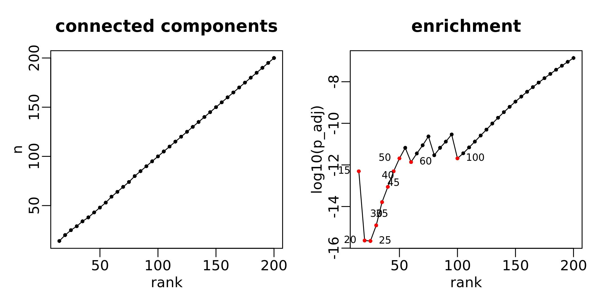{width=90%} 

```{r echo=FALSE, message=FALSE, warning=FALSE, results='hide'}
head(dmfind_demo$ae_gsea$en_summary)
```

## Comparison of NR and NE

It's possible to compare the results of network resampling and network enrichment and obtain the rank that correpond to the most significant pairs of p-values:

```{r eval=FALSE}
top_net_sig <- cmp_top_net_scores(NRRes = nr_res, netEnrRes = ae_res)
head(top_net_sig)
```

```{r echo=FALSE}
dmfind_demo$top_net_sig
```

where `score` is equal to the product between the two $-\text{log}_{10}(p)$.

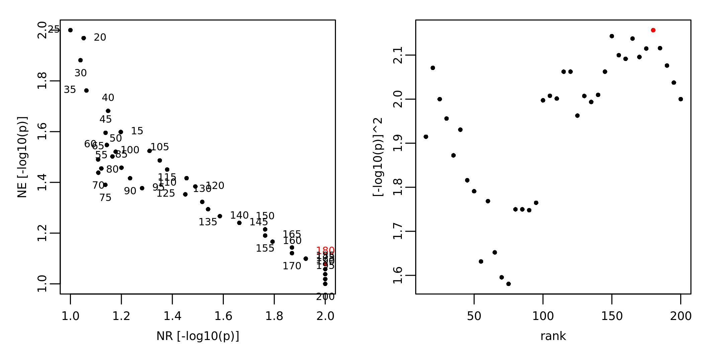{width=90%} 

## Modularity assessment

The function `assess_modularity()` quantifies the community structure and the modularity of between the top $k$ genes. This is another piece of information that can be useful to select the top networks. In this example, we study the modularity between tthe top 200 genes sorted by $S_p$:

```{r eval=FALSE}
assess_mod_res <- assess_modularity(G = G, vertices = rownames(resSp$Sp)[order(-resSp$Sp[, 1])[1:200]])
```
The output is a table with the trend of the modularity and number of communities at various ranks between the top genes considered.
```{r echo=FALSE}
head(dmfind_demo$am_res)
```
These results can be plotted through `plot_modu_trend()`.

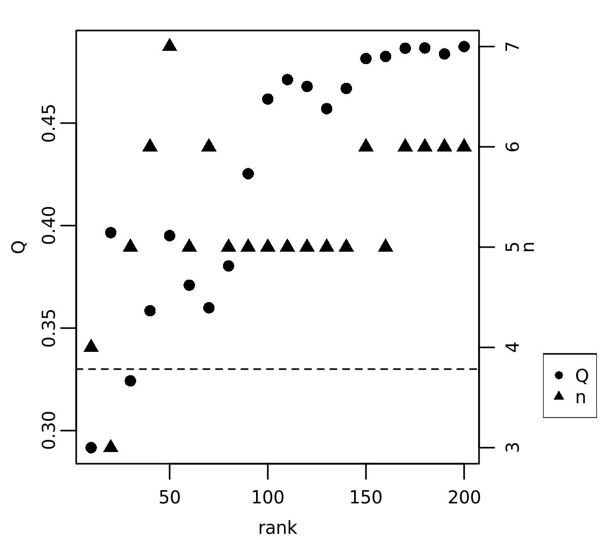{width=90%} 


## Top networks definition
Once the rank that is associated to the top networks that one considers optimal, these can be extracted by means of `extract_module()`. Here we consider the top 120 genes by $S_p$:

```{r eval=FALSE}
top_networks <- extract_module(graph = G, selectedVertices = rownames(resSp$Sp)[order(-resSp$Sp[, 1])[1:180]], NSIRes = resSp, minSubnetSize = 2)
```

```{r echo=FALSE}
summary(dmfind_demo$top_nets)
```

# Topological charcaterization of top networks

## Community structure

The function `find_communities()` run a series of algorithms from igraph to detect the presence of communities

We can also assess a topological analysis of our network.
```{r eval=FALSE}
res_comm <- find_communities(top_network)
```
```{r echo=FALSE}
dmfind_demo$res_comm$info
```

After having decided which the best partition (e.g. the one that maximes the modularity), this can be added to the top networks:
```{r eval=FALSE}
top_networks <- assign_communities(top_networks, res_comm$comm$multilev)
```
```{r echo=FALSE}
summary(dmfind_demo$top_nets)
```

## Functional cartography

The function `functional_cartography()` performs the functional cartography analysis [@Guimera2005], where each gene is scored by its participation coefficient $P$ and the within module degree score, which is a z-score [@Guimera2005] or a probability of interaction [@Joyce2010]. These values are used to classify genes in 7 classes:

* ultra peripheral nodes (R1): nodes with all their links within their module;

* peripheral nodes (R2): nodes with most links within their module;

* non-hubs connector nodes (R3): nodes with many links to other modules;

* non-hubs kinless nodes (R4): nodes with links homogeneously distributed among all modules.

* provincial nodes (R5): hub nodes with the vast majority of links within their module (pc <= 0.3);

* connector hubs (R6): hubs with many links to most of the other modules (0.30 < pc <= 0.75);

* kinless hubs (R7): hubs with links homogeneously distributed among all modules (pc > 0.75).

```{r eval=FALSE, include=TRUE}
top_networks <- functional_cartography(top_networks)
```
The output will contain the vertex attributes `R`, `P`, and `wmd_score`. A dedicated function exist to obtain the functional cartography:

```{r eval=FALSE, include=TRUE}
plot_fc(dmfind_demo$top_nets)
```
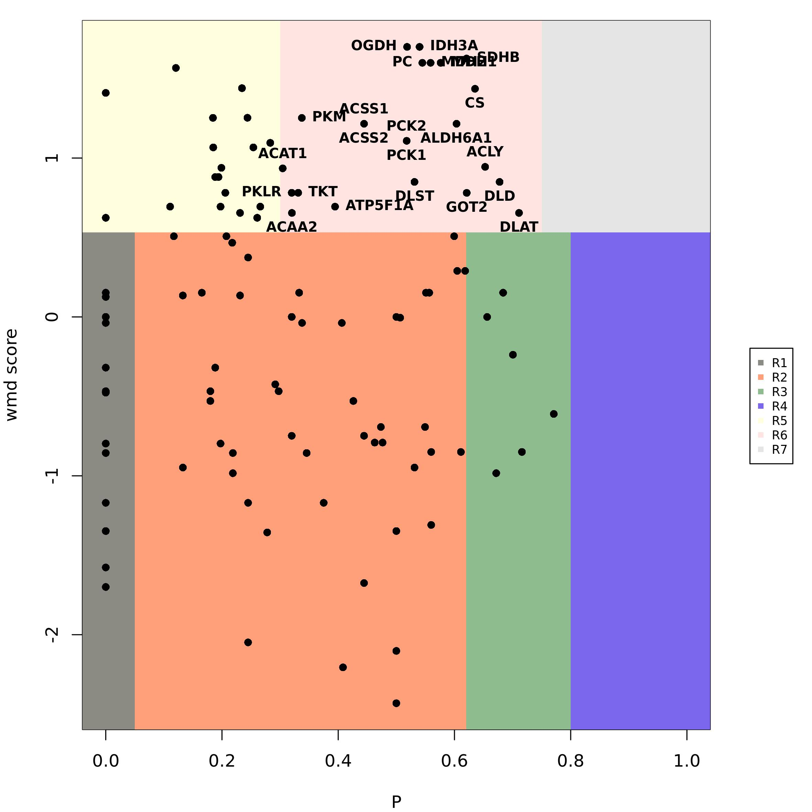{width=90%} 

## Network comparison - TO DO

This section is a draft.

There are several ways to compare networks: with the function "net_comparison" we could perform some analysis, such as union, intersection, Jaccard index & Overlap coefficient calculation

The input data must be a list of n interactomes

To use this function you could create two or more toy model with the igraph function "barabasi.game", remember to set labels to the vertices.
```{r eval=FALSE, include=TRUE}
NetComp(NetList, union=T, intersection=T, centrMeas=T, ji=T, oc=T)
```

This function return a list containing the occurrences matrix where every column are the input networks
Optionally you can choose to perform the union, the intersection (both vertices and edges), the calculation of the Jaccard index, the Overlap coefficient and the centrality measures for every input interactome.


# Visualization

The function `plot_network()` provides a means to produce network visualizations. For example, here we plot the network producing a layout that takes into account the community structure and color the genes by $\mathbf{x}_0$ (a $\{0,1\}-$vector)

```{r eval=FALSE}
lo <- plot_network(top_networks, colorBy = "X0", colorQuant = F, pal = c("gray", "purple"), labelBy = "", community = res_comm$comm$multilev, vertex.size=5)
```
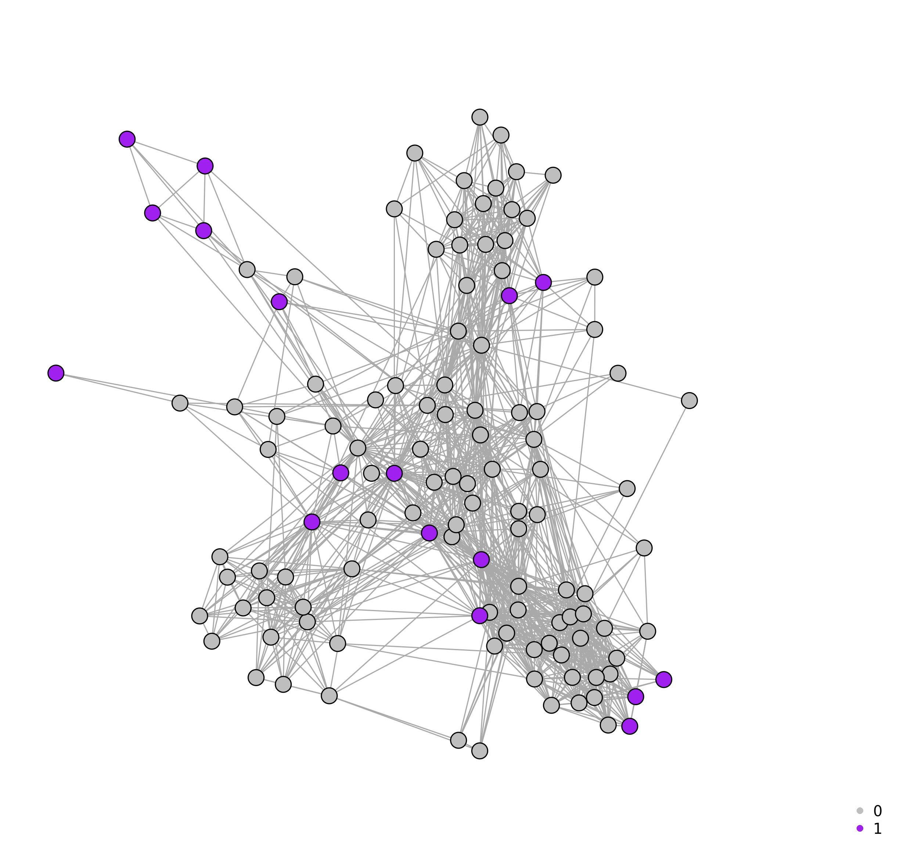{width=90%} 

In this other example, we color by community, using the layout obtained from the previous plot:
```{r eval=FALSE}
plot_network(top_networks, colorBy = "comm_id", colorQuant = F, pal = pals::brewer.pastel1(length(unique(V(top_networks)$comm_id))), labelBy = "", community = res_comm$comm$multilev, vertex.size=5, lo=lo)
```
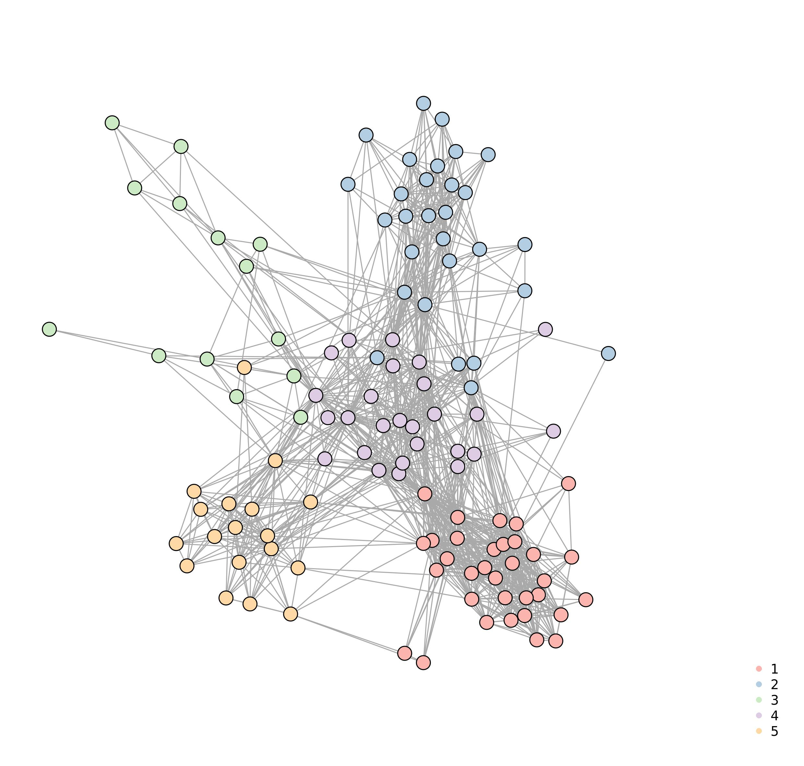{width=90%} 
The package provides a means to reconstruct the network of communities:

```{r eval=FALSE, include=TRUE}
commNet <- comm_net(top_networks)
plot_network(commNet, colorBy = "name", colorQuant = F, pal = pals::brewer.pastel1(vcount(commNet)), labelBy = "name")
```
The number of genes of every community is stored in the vertex attribute `w`:

```{r echo=FALSE}
V(dmfind_demo$commNet)$w
```

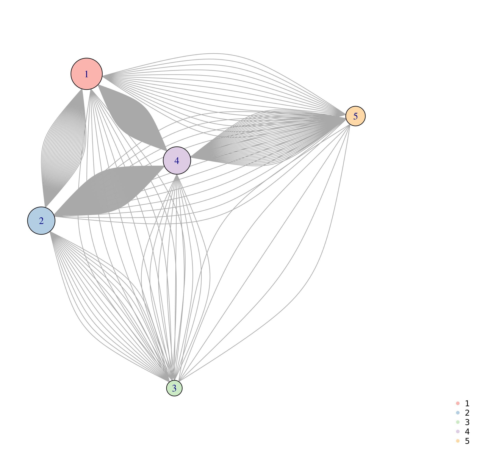{width=90%} 
Throught the argument `remove.multiple = T` the network will have just one link for every pairs of community. In this case, the number of links between genes of two communities is stored in the  edge attribute `w`:

```{r eval=FALSE, include=TRUE}
commNet <- comm_net(dmfind_demo$top_nets, remove.multiple = T)
plot_network(commNet, colorBy = "name", colorQuant = F, pal = pals::brewer.pastel1(vcount(commNet)), labelBy = "name")
```
```{r echo=FALSE}
E(dmfind_demo$commNet)$w
```

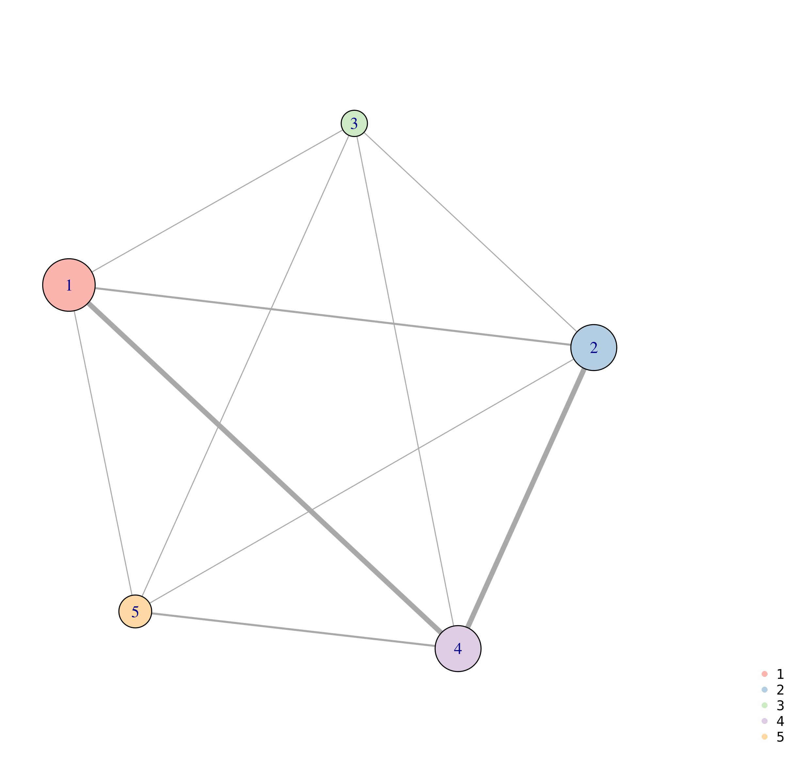{width=90%} 


# Session Info {- .smaller}
```{r sessioninfo}
sessionInfo()

```
