```{r setup, include=FALSE}
knitr::opts_chunk$set(
  comment  = "#>",
  error    = FALSE,
  warning  = FALSE,
  message  = FALSE,
  fig.width = 10
)
options(width = 100)
```

---
```{r, echo = FALSE, results = 'asis'}
  devtools::load_all()
  data("dmfind_demo")
```

{width=300px}

# Introduction {#introduction}

This vignette describes how to use the R package dmfind, which implements network diffusion-based analysis of omics data for the identification of differentially enriched modules. The tool implements functions for:

- performing network diffusion (also known as network propagation) of one or more vectors of gene-weights throughout an interactome of gene-gene interactions;
- defining ranked gene lists, where genes are prioritized according to the Network Smoothing Index (NSI), which is proportional to gene-weights and the network proximity of high gene-weights;
- assessing the characteristics of the (top) networks defined by the top ranked genes, based on proximity of high scoring genes, enrichment in high scoring genes, modularity and number of communities;
- obtaining the functional cartography of the top networks;
- comparing multiple networks by topology;
- visualizing the top networks and the relations between communities.

If you use this package please cite:

- Bersanelli\*, Mosca\*, et al., Network diffusion-based analysis of high-throughput data for the detection of differentially enriched modules. Sci Rep 6, 34841 (2016). <https://doi.org/10.1038/srep34841> 


# Getting started

## Installation 

To install this package, start R and enter:

```{r, eval=FALSE}
if (!requireNamespace("devtools", quietly = TRUE)){
  install.packages(devtools)
}
devtools::install_github("emosca-cnr/NPATools", build_vignettes=T)
devtools::install_github("emosca-cnr/dmfind", build_vignettes=T)
```

## Overview of the workflow

The typical steps are the followings:

1. Definition of the input matrices;
2. Calculation of the network-smoothing index;
4. Definition of the top networks;
5. Topological analysis.

We will consider a toy modular network of 500 "genes" obtained using `igraph::barabasi.game()`, where a community is enriched in higher scores compared to the others.

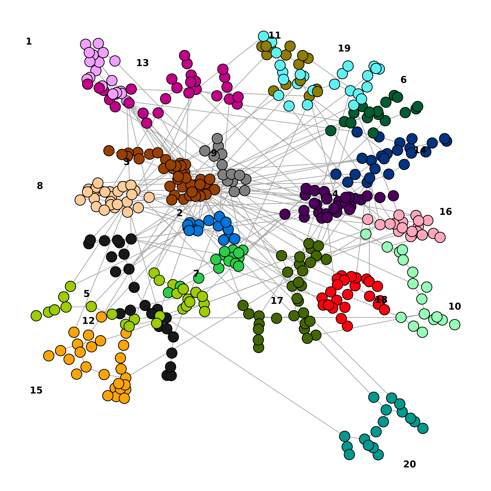{width=90%}
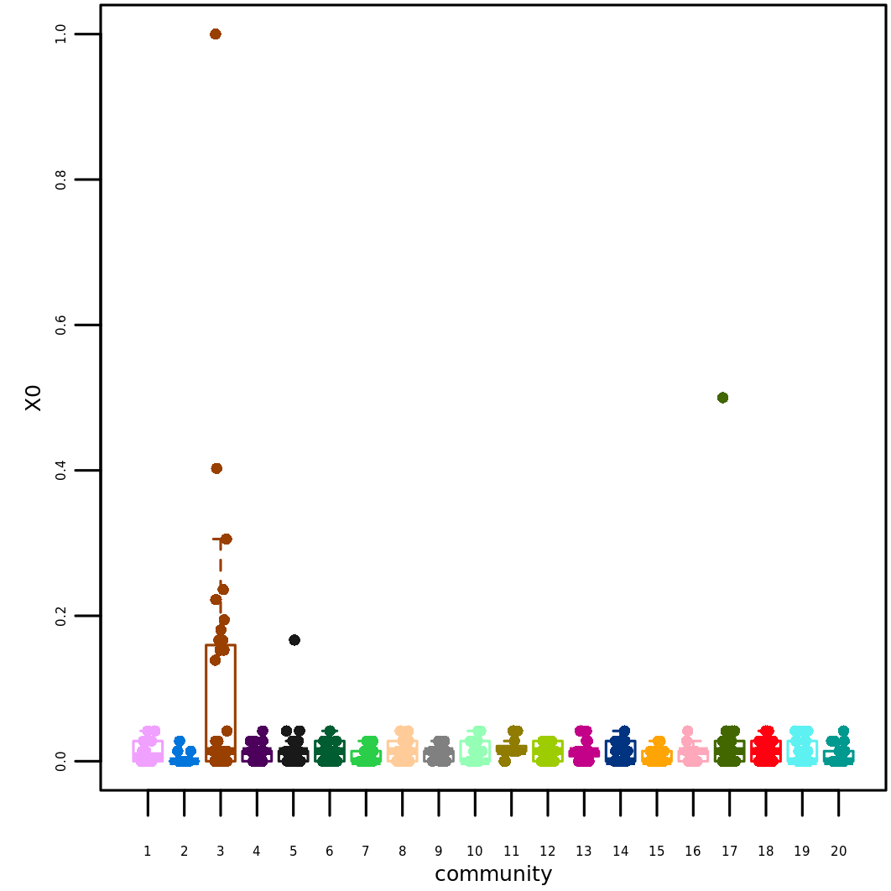{width=90%}

# Definition of the input matrices

The analysis requires the following inputs:

- $\mathbf{W}$, an $N \times N$ *normalized adjacency matrix*, which represents the interactions between genes, e.g.: 
```{r, echo=FALSE}
head(dmfind_demo$W[, 1:6])
```

- $\mathbf{X}_0$, a $N \times m$ matrix with column vectors $\mathbf{x_0}$ that contain gene-related quantities;

- a vector to assign each column of $\mathbf{X}_0$ to any of two classes, only for differential NSI.

**IMPORTANT**:

* $\mathbf{W}$ and $\mathbf{X}_0$ must be defined over the same identifiers;
* the normalization of the adjacency matrix must be done by means of the function `normalize_adj_mat()`, which requires a binary adjacency matrix;
* the relevance of the genes corresponding to the rows of $\mathbf{X}_0$ is proportional to their values, that is, the higher the better; negative values are not allowed. 

# The network smoothing index (NSI)

The network smoothing index (NSI) compares the initial state $\mathbf{x}_0$ with the steady-state $\mathbf{x}_s$ reached after network diffusion:

$$S_j(\mathbf{x_0}) = \frac{x_{sj}}{x_{0j}+\epsilon}$$
where the parameter $\epsilon$ tunes the relevance of the initial state.  The impact of $\epsilon$ can be assessed by means of the function `eval_eps()`, which finds an optimal value of $\epsilon$ that takes into account the network proximity of $\mathbf{x_0}$ values and $\mathbf{x_s}$ values in the networks composed of the top $n$ genes ranked by $S$. The network proximity is quantified by $\Omega$ function [@Bersanelli2016]:

$$\Omega (n) = \mathbf{y}^T(n) \cdot \mathbf{A}(n) \cdot \mathbf{y}(n)$$
calculated over $\mathbf{y} = \mathbf{x_0}$ or $\mathbf{y} = \mathbf{x_s}$. Let $O_{\mathbf{x}_0}(\epsilon)$ and $O_{\mathbf{x}_s}(\epsilon)$ be sums of $\Omega$ values over the top ranking genes $\{1, 2, ..., n\}$, calculated using  $\mathbf{x_0}$ and  $\mathbf{x_s}$ respectively. The optimal $\epsilon$ value is found as follows:
$$\text{arg}\,\max\limits_{\epsilon}\, \Bigg( \frac{O_{\mathbf{x}_0}(\epsilon)}{\text{max} (O_{\mathbf{x}_0}(\epsilon))} + \frac{O_{\mathbf{x}_s}(\epsilon)}{\text{max}(O_{\mathbf{x}_s}(\epsilon)}\Bigg)$$

we will see below specific examples for the permutation-adjusted $S$ and differential $S$.

## Permutation-adjusted $S$;

The Permutation-adjusted $S$ is defined as:
$$Sp_j = S_j \cdot -log_{10}(p_j)$$
where $p$ is a statistical assessment of $S$ based o vertex permutations applied to $\mathbf{X}_0$ and $\mathbf{W}$. The input matrix $\mathbf{X}_0$ contains one (typically) or more columns of any type of gene weights (e.g., $−\text{log}_{10}(p)$):

```{r, echo=FALSE}
head(dmfind_demo$X0)
```

As mentioned above, we must find a value for$\epsilon$. The default behavior of `eval_eps()` consists in testing $\epsilon$ values that lie from two orders of magnitude below the minimum of strictly positive $\mathbf{X}_0$ values to two orders of magnitude above the maximum of $\mathbf{X}_0$:

```{r, eval=FALSE}
ee <- eval_eps(X0 = X0, W = W)

Generating epsilon based on X0 values...
# orders of magnitude:  6 
# values considered:  24
eps: 0.0001388889 0.0002496515 0.0004487462 0.000806617 0.001449887 0.002606157 0.004684544 0.008420423 0.01513563 0.02720616 0.04890281 0.08790234 0.1580036 0.28401 0.5105054 0.9176286 1.649429 2.964833 5.329259 9.579293 17.21869 30.95043 55.63311 100 
Performing ND...
optimal eps: 0.5105054
```
In our case study we obtain a value of about 0.51, which is stored in the element `ee$opt_eps`. It is possible to perform a visual inspection of the effect of $\epsilon$ over $\Omega$ via `plot_omega_eps()`

```{r, eval=FALSE}
plot_omega_eps(ee)
```
which shows the values of $\Omega$ by rank
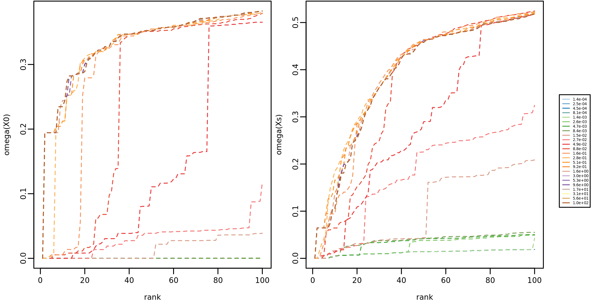{width=90%}
and the values of $O_{\mathbf{x}_0}(\epsilon))$ and $O_{\mathbf{x}_s}(\epsilon))$

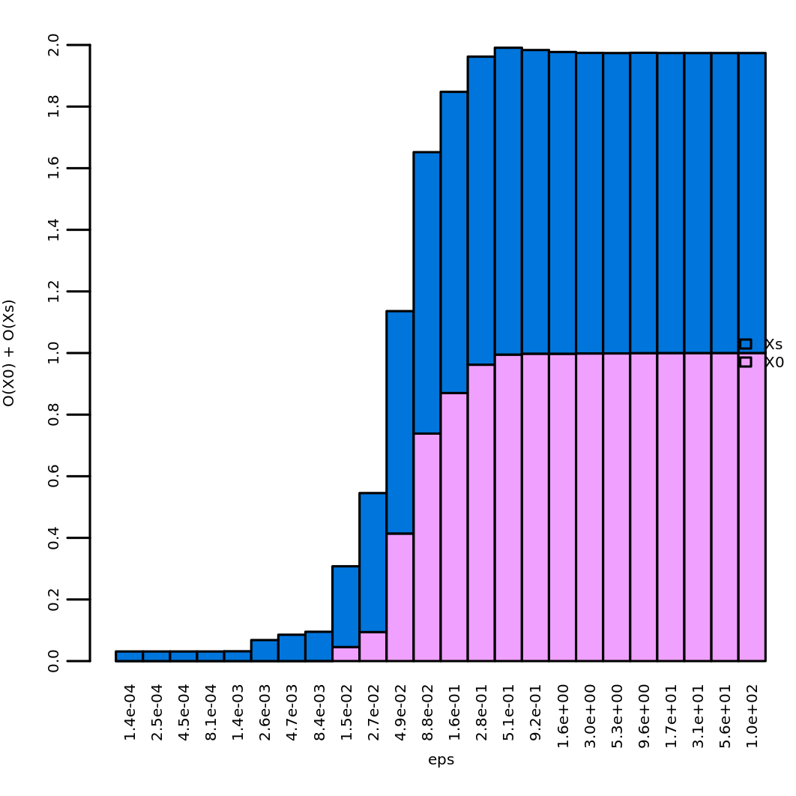{width=90%}

The permutation-based NSI is calculated via `calc_adjND()`, where we use the optimal $\epsilon$ value obtained above and consider 99 permutations between vertices matched by degree:

```{r, eval=FALSE}
resSp <- calc_adjND(X0 = X0, W = W, eps = ee$opt_eps, bin_type = "number", method = "d", cut_par = 2, k=99)
BPPARAM
class: SerialParam
  bpisup: FALSE; bpnworkers: 1; bptasks: 0; bpjobname: BPJOB
  bplog: FALSE; bpthreshold: INFO; bpstopOnError: TRUE
  bpRNGseed: ; bptimeout: 2592000; bpprogressbar: FALSE
  bpexportglobals: TRUE; bpforceGC: FALSE
  bplogdir: NA
  bpresultdir: NA
Permutation type: degree 
Total permutations: 100 
Minimum possible FDR: 0.01 
cut_par: 2 
bin_type: number 
vertex sets and bins: 307 144 
Min possible k: 5.550294e+249 
ND over X0 permutations
ND over W permutations
calculation of S
calculation of p-values
```

The result is a list that contains input and output quantities.
```{r, echo=FALSE}
names(dmfind_demo$resSp)
```
The main stuff that one should consider tuning is the permutation approach. Please read the documentation `?calc_adjND()`.


## Differential NSI (cases vs controls)

The differential NSI is calculated comparing the NSI of two classes of subjects, based on their average "profiles" $\bar{\mathbf{x}_{o1}$ and $\bar{\mathbf{x}_{o2}}$: 

$$\Delta S_j = S_j (\bar{\mathbf{x}_{o2}}) - S_j (\bar{\mathbf{x}_{o1}})$$
In this case each olumn of the input matrix $\mathbf{X}_0$ carries sample-level information (e.g., mutation profiles of patients)

```{r, echo=FALSE}
head(dmfind_demo$X0ds)
```

which will be averaged to obtain $\bar{\mathbf{x}_{o1}}$ and $\mathbf{x}_{o2}$ according to a given partition of subjects in two classes. To find an appropriate $\epsilon$ values for each of the two classes, we run `eval_eps()` on $\bar{\mathbf{x}_{o1}}$  and $\bar{\mathbf{x}_{o2}}$ :

```{r include=TRUE, eval=FALSE, message=FALSE, results='hide'}
X0ds_means <- calc_X0_mean(X0 = X0ds, classes = classes)
eeds <- eval_eps(X0 = X0ds_means, W = W, top = 100)
enerating epsilon based on X0 values...
# orders of magnitude:  5 
# values considered:  20 
eps: 0.002 0.003534632 0.006246812 0.01104009 0.01951133 0.03448268 0.0609418 0.1077034 0.190346 0.3364015 0.5945277 1.050718 1.856951 3.28182 5.800013 10.25046 18.11579 32.01633 56.58298 100 
Performing ND...
optimal eps: 1.050718 10.25046 
```
In our case study we obtain a value of about 1 and 10 for respectively class 1 and 2. We can now run the analysis by:

```{r include=TRUE, eval=FALSE, message=FALSE, results='hide'}
resdS <- calc_dS(X0 = X0ds, W = W, classes = classes, eps = eeds$opt_eps)
network diffusion
calculation of dS
```
The result will contain the following quantities:
```{r echo=FALSE}
names(dmfind_demo$resdS)
```


# Visualization of the NSI values

From now on, we will focus only on the results of $Sp$ analysis, because the functions that will be described below work analogously for $Sp$ and $\Delta S$.

The results NSI calculation can be visually explored throug the function `plot_NSI()`. In the case of $Sp$ two interesting plots are the distribution of $S$ values and p-value (that is "effect size" vs significance):

```{r eval=FALSE}
plot_NSI(resSp, x="S", y="p")
```

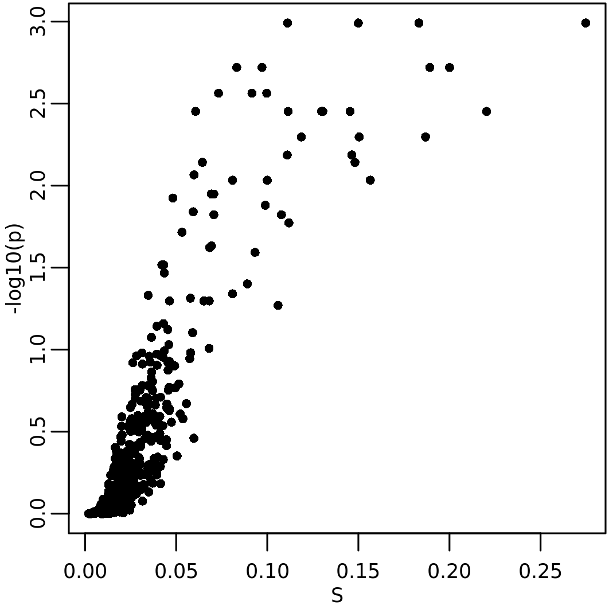{width=90%} 

and the relation between $S_p$ and the initial state:

```{r eval=FALSE}
plot_NSI(resSp, x = "X0", y="Sp")
```
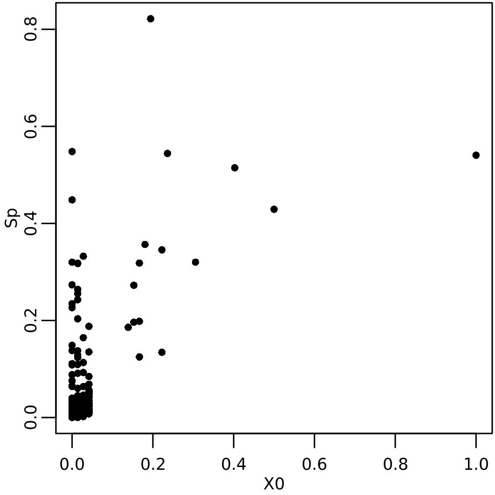{width=90%}

Note that genes with a high initial value gets high $S_p$. In addition some genes with low initial value get a high $S_p$, which implies a network proximity of these genes to those with high $\mathbf{x}_0$.

# Definition of the top networks

The package `dmfind` provides two types of analysis to guide the choice of the "top" networks, that is the networks that contain the interactions between genes with high $\mathbf{X}_0$:

- **network resampling (NR)**, which scores the presence of genes with high NSI values in network proximity;
- **network enrichment (NE)**, which scores network enrichment in genes with high $\mathbf{X}_0$;
- **modularity analysis**, which scores network modularity

These analysis are applied over a number of top genes by $S_p$ or $\Delta S$. In human genome-wide analysis, a typical number could be 500.

## Network resampling

Network resampling can be used to asses the presence of significantly connected modules
```{r include=TRUE, eval=FALSE, message=FALSE, warning=FALSE, results='hide'}
nr_res <- NR(G = bg, rankedVector = sort(resSp$Sp[, 1], decreasing = T)[1:50], k = 99)
plot_NR(nr_res)
```
The element `nr_res$NRsummary` contains the NR results by rank
```{r, echo=FALSE}
head(dmfind_demo$nr_res$NRsummary)
```

The visual representation is obtained `plot_NR()`:
```{r include=TRUE, eval=FALSE, message=FALSE, warning=FALSE, results='hide'}
plot_NR(nr_res)
```

We observe that the real $\Omega$ values begins to be clearly higher than permuted values after approximately 20 genes, which indicates the presence of a high scoring connected gene module:

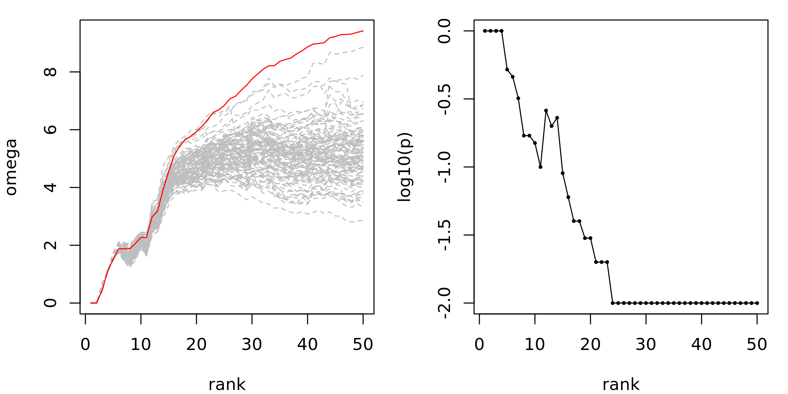{width=90%} 

## Network Enrichment

The enrichment analysis assess to which extent the top networks are enriched in high $\mathbf{x}_0$ values. Depending on how $\mathbf{x}_0$ is defined, this task can be done by means of Over Representation Analysis (ORA) or Gene Set Enrichment Analysis (GSEA). In the following example, we explore the enrichment of the networks formed by the top 50 genes by $S_p$, using GSEA:

```{r include=TRUE, eval=FALSE, message=FALSE, warning=FALSE, results='hide'}
ne_res <- assess_enrichment(G = bg, topList = names(sort(resSp$Sp[, 1], decreasing = T)[1:50]), X0Vector = setNames(X0[, 1], rownames(X0)), type = "gsea", minNetSize = 5, ranks = 1:50)
```
The table `ne_res$en_summary` cotains the results, which, as expected, show that the top networks are highly enriched in top scoring genes:

```{r echo=FALSE}
head(dmfind_demo$ne_res$en_summary[, ])
```

## Comparison of NR and NE

The results of NR and NE can be combined to find possible networks that are optimal based on the two analyses. In our case study we found that the network composed of the top 24 genes is associated with the most significant p-values from NR and NE:

```{r eval=FALSE}
nr_ne_cmp <- cmp_top_net_scores(NRRes = nr_res, netEnrRes = ae_res)
Smallest highest scoring network at rank:  24 
Overlapping points detected, adding some jitter
```
The result is a table the reports the statistics rank by rank:
```{r echo=FALSE}
head(dmfind_demo$nr_ne_cmp)
```
The function also produces the figure `NR_vs_NE.png`.

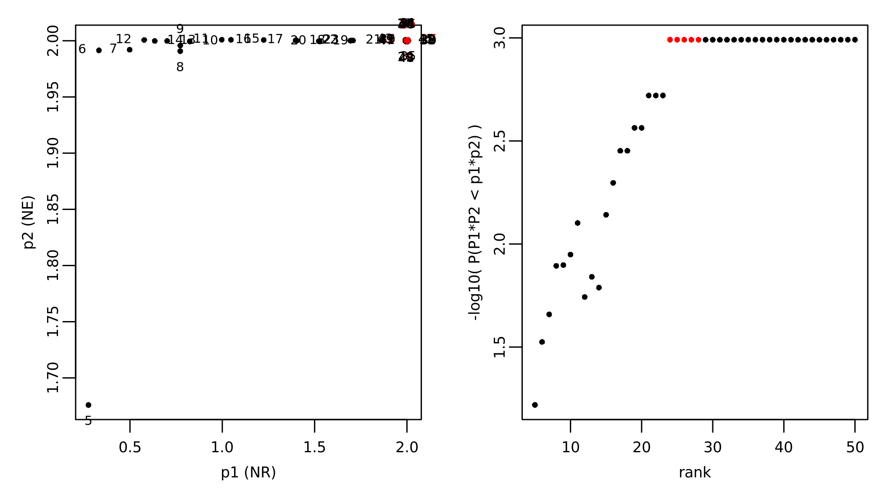{width=100%} 


## Modularity assessment

The function `assess_modularity()` quantifies the community structure and the modularity among the networks composed of the top ranking genes. This is another piece of information that can be useful to select the top networks. In this example, we study the modularity between the top 50 genes sorted by $Sp$:

```{r eval=FALSE}
assess_mod_res <- assess_modularity(G = bg, vertices = rownames(resSp$Sp)[order(-resSp$Sp[, 1])[1:50]], ranks = 1:50)
```
The output is a table with the trend of the modularity and number of communities at various ranks between the top genes considered.
```{r echo=FALSE}
head(dmfind_demo$assess_mod_res)
```
These results can be plotted through `plot_modu_trend()`:
```{r eval=FALSE}
plot_modu_trend(assess_mod_res)
```
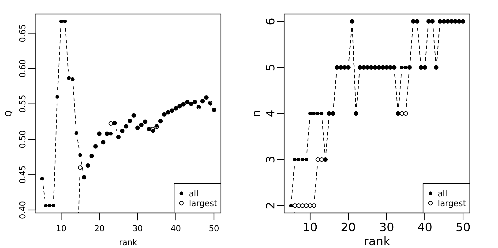{width=90%} 

## Extraction of the top networks

Once the rank that is associated to the top networks that one considers optimal, these can be extracted by means of `extract_module()`. Here we consider the top 120 genes by $S_p$:

```{r eval=FALSE}
top_nets <- extract_module(graph = bg, selectedVertices = rownames(resSp$Sp)[order(-resSp$Sp[, 1])[1:20]], NSIRes = resSp, minSubnetSize = 2)
```

```{r echo=FALSE}
dmfind_demo$top_nets
```

# Topological charcaterization of top networks

## Community structure

The function `find_communities()` runs a series of algorithms to detect the presence of communities: 
```{r eval=FALSE}
res_comm <- find_communities(top_nets)
```
The element ``res_comm$info`` contains the modularity score $Q$ and the number of communities:
```{r echo=FALSE}
dmfind_demo$res_comm$info
```
In this case the fastgreedy algorithm found a better partition with the same number of community, and therefore we assign its results to the igraph object containing the top networks:
```{r eval=FALSE}
top_nets <- assign_communities(top_nets, res_comm$comm$fastgreedy)
```

## Functional cartography

The function `functional_cartography()` performs the functional cartography analysis [@Guimera2005], where each gene is scored by its participation coefficient $P$ and the within module degree score, which is a z-score [@Guimera2005] or a probability of interaction [@Joyce2010]. These values are used to classify genes in 7 classes:

* ultra peripheral nodes (R1): nodes with all their links within their module;

* peripheral nodes (R2): nodes with most links within their module;

* non-hubs connector nodes (R3): nodes with many links to other modules;

* non-hubs kinless nodes (R4): nodes with links homogeneously distributed among all modules.

* provincial nodes (R5): hub nodes with the vast majority of links within their module (pc <= 0.3);

* connector hubs (R6): hubs with many links to most of the other modules (0.30 < pc <= 0.75);

* kinless hubs (R7): hubs with links homogeneously distributed among all modules (pc > 0.75).

```{r eval=FALSE, include=TRUE}
top_nets <- functional_cartography(top_nets)
```
The output is the igraph object given in input with the addition of vertex attributes `R`, `P`, and `wmd_score`.

```{r echo=FALSE}
dmfind_demo$top_nets_fc
```

A dedicated function exist to obtain the functional cartography:

```{r eval=FALSE, include=TRUE}
plot_fc(top_nets, labelBy = "name")
```

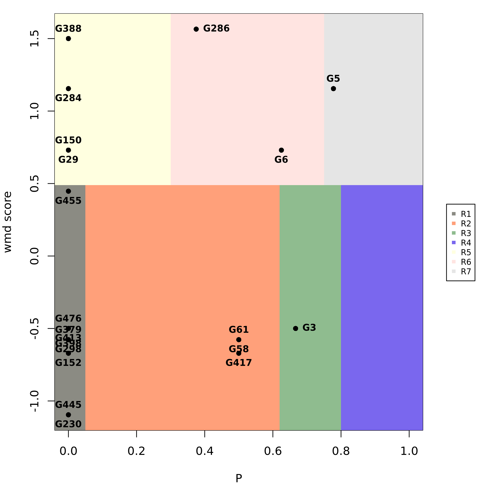{width=90%} 

# Visualization

The function `plot_network()` provides a means to produce network visualizations. Please read its documentation (`?plot_network`) for further details. For example, here we plot the top network producing a layout that takes into account the community structure and color by community:

```{r eval=FALSE}
lo_tn <- plot_network(top_nets, vertex.size=5, colorQuant = T, colorBy = "comm_id", community = res_comm$comm$fastgreedy, pal=pals::alphabet(max(res_comm$comm$fastgreedy$membership)), labelBy = "name",  vertex.label.degree=pi/2, vertex.label.dist=1)
```
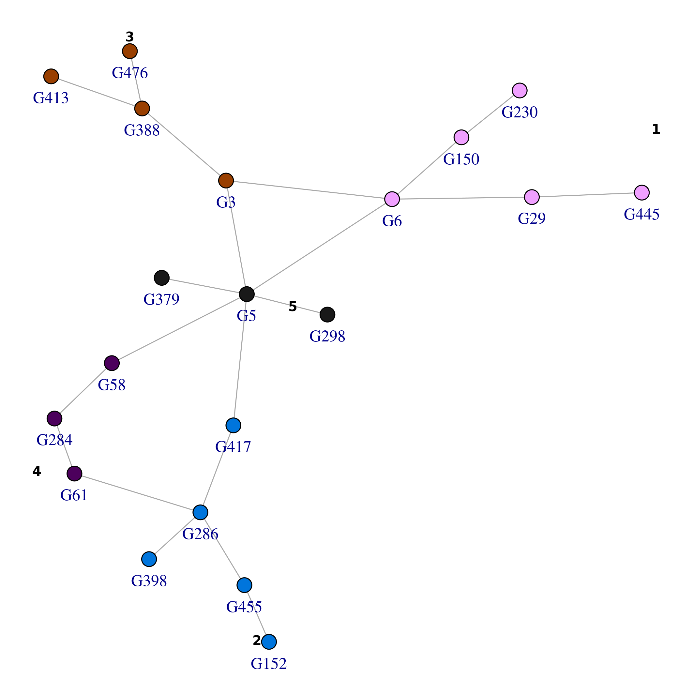{width=90%} 

while in this second example we color by $\mathbf{X_0}$

```{r eval=FALSE}
plot_network(top_nets, vertex.size=5, colorQuant = T, colorBy = "X0", pal=pals::brewer.purples(3), lo = lo_tn, labelBy = "name", vertex.label.degree=pi/2, vertex.label.dist=1)
```
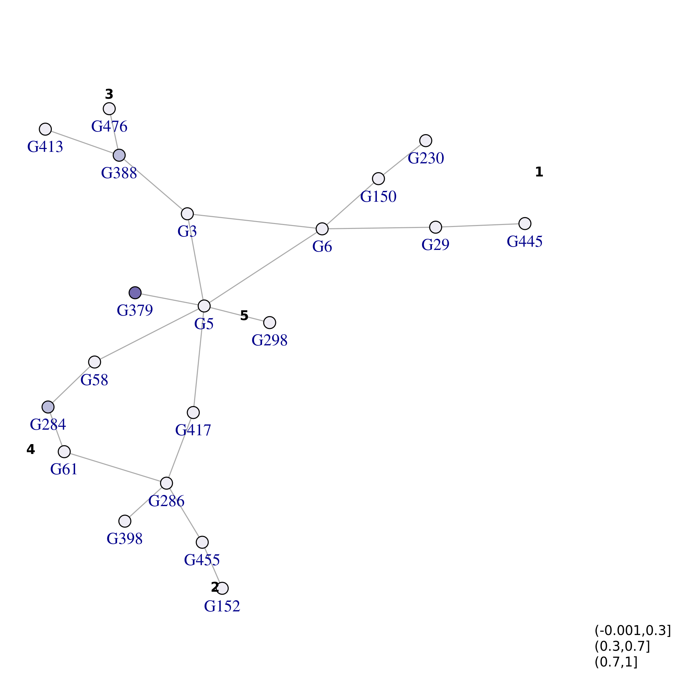{width=90%} 
and lastly by $S_p$:

```{r eval=FALSE}
plot_network(top_nets, vertex.size=5, colorQuant = T, colorBy = "Sp", pal=pals::brewer.purples(3), lo = lo_tn, labelBy = "name", vertex.label.degree=pi/2, vertex.label.dist=1)
```
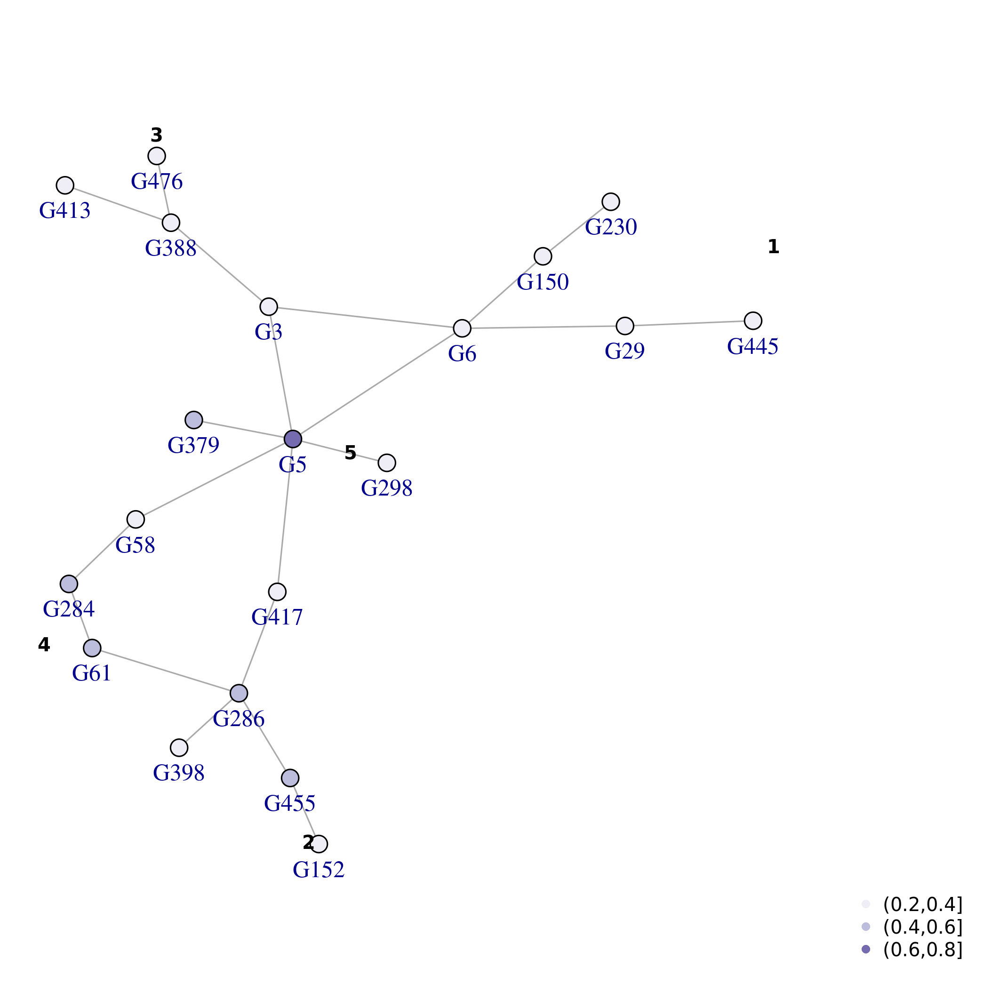{width=90%} 

# Interactome derived from STRING v12

This package contains an interactome derived from STRING db v12.0 [@Szklarczyk2022], consisting of 17288 genes and 174962 interactions. Only interactions with confidence >=700 and the top 3 interactions with confidence >=400 & < 700 were considered. Confidence score was calculated without text mining evidence, as described at the URL https://string-db.org. Original protein identifiers were mapped to Entrez Gene identifiers using mappings provided by STRING (https://string-db.org) and NCBI (https://ftp.ncbi.nlm.nih.gov, download date 2023-09-19). The interactome is available as an igraph object:

```{r}
data(dmfind)
string.v12.Entrez.ntm.700.400.k3
```

The matrix $W$ can be derived as follows:
```{r eval=FALSE}
A <- get.adjacency(string.v12.Entrez.ntm.700.400.k3, type = "both")
W <- normalize_adj_mat(A)
```


# References
